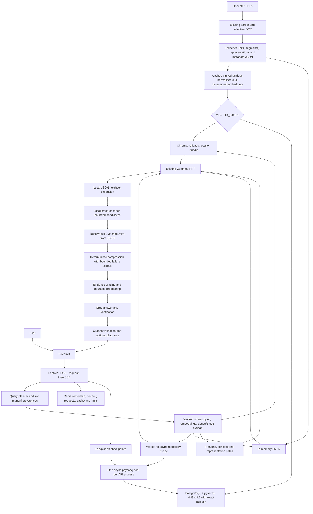
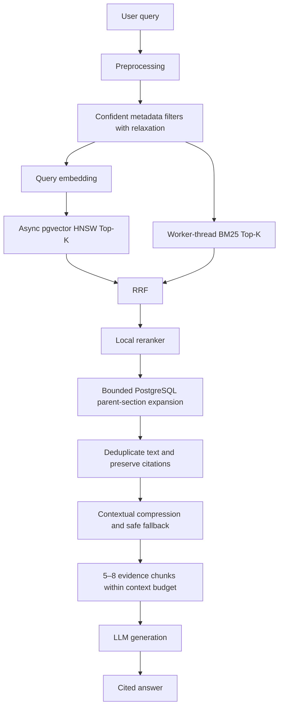

# Opcenter production review — 2026-09-07

## Verdict

**Optimization update:** HNSW, parallel dense/BM25 retrieval, bounded request-local
query embedding reuse and reranker profiling are now implemented and benchmarked.
See [RETRIEVAL_OPTIMIZATIONS.md](RETRIEVAL_OPTIMIZATIONS.md) for current configuration
and [measured results](../benchmarks/BENCHMARK_RESULTS.md). Local final hybrid p50
is 85.65 ms versus 131.97 ms exact pgvector, a 35.10% reduction, with matching
Recall@5/MRR on 44 labeled questions across six rounds. Chroma was still faster
at 80.30 ms. Parent expansion remains JSON-based; structured filter relaxation,
complete request metrics and production load/held-out quality gates remain pending.

The original review findings below are retained as a historical record; statements
that HNSW or branch parallelism are absent are superseded by this update.

**Not ready to certify the final optimized architecture.** The repository contains
the existing Chroma RAG application and the phase 2–3 PostgreSQL storage/import
increment. The proposed HNSW, metadata-routing, parallel retrieval, comprehensive
request instrumentation and before/after benchmark changes from prompts 4–10 were
not implemented. This document reports that state, not a completed target.

The local deployment has now cut over to pgvector, while Chroma remains selectable
and the code default remains Chroma. Native PostgreSQL 17.11 / pgvector 0.8.6 run
independently of the broken Docker daemon. The schema and full JSON corpus backfill
were applied and validated: eight documents, 15,721 body chunks, 21,121 search
representations, 384 dimensions, and no missing identifiers/pages/vectors or duplicate
chunk IDs. Real SQL integration tests and a cited API answer passed. Container health
and the unimplemented optimization phases remain unverified. No Chroma data or
fallback code was removed. See [LOCAL_PGVECTOR_CUTOVER.md](LOCAL_PGVECTOR_CUTOVER.md).

## Actual implemented architecture



SQLite checkpoints are also supported for local use, including alongside pgvector
retrieval. Local JSON artifacts remain mandatory in both vector modes.

## Intended architecture — future implementation



This graph is a target, not a runtime trace or verified performance claim.

## Review scope and verified fixes

Review covered storage/import, async lifecycle, graph/retrieval/compression,
request streaming, existing inference/LLM limits, cache/logging, Docker, configuration,
test coverage and benchmark code. Eight new regression cases failed before fixes
and passed afterward:

1. CLI pool construction errors previously occurred after starting the background
   event loop, leaking that loop/thread. Configuration and repository construction
   now precede thread startup; failed thread startup closes the loop.
2. Startup cancellation bypassed `except Exception`, leaving acquired resources
   open. The cancellation/BaseException path now closes the exit stack and re-raises.
3. Overlapping body/representation IDs could be published and only rejected later
   by JSON/store validation. Backfill now rejects overlap before embedding/publication.
4. Whitespace-only document identity passed preflight. It is now rejected.
5. Boolean and fractional schema dimensions passed the numeric-range guard. Only
   actual integers in pgvector's supported storage range are now accepted.
6. Compression exceptions aborted the answer path. All node compression call sites
   now fall back to at most 700 characters of original selected evidence, retaining
   page/source/parent metadata without mutating the original document. Logs contain
   the exception class, not its possibly sensitive message. Fallback excerpts can
   be incomplete and are labeled `bounded_original_fallback` internally.
7. Repeated IDs in a single list inflated RRF contributions. Shared fusion now
   deduplicates each source list before assigning ranks. Source weights remain intact.

Files changed in this hardening increment: `src/vector_store.py`,
`src/pgvector_migrate.py`, `backend/dependencies.py`, `src/retrieval.py`,
`src/nodes.py`, `tests/test_production_hardening.py`, `README.md`, and this document.
Earlier phase 2–3 changes are still uncommitted and were preserved. The unrelated
resume PDF was not touched.

## Production checklist and remaining risks

| Area | Review outcome / remaining work |
| --- | --- |
| Async correctness | PostgreSQL is truly async underneath a sync worker bridge. The bridge rejects calls from its owning loop. Retrieval branches are not parallel. |
| Blocking calls | Embedding, reranking and retrieval run in workers on the async path; startup model loading/index checks use workers. The graph's synchronous neighbor expansion and some SSE figure/file formatting remain synchronous. Profile event-loop lag before production. |
| Cancellation | Startup resource cleanup fixed. Cancelling `to_thread` does not stop the underlying CPU work; the inference gate can release before that work exits. Durable worker admission/cancellation remains a load-test gate. |
| Pool lifecycle | One pool per process shared with PostgreSQL checkpoints when enabled. CLI imports have a job-owned pool. Real connection reuse and cleanup tests passed on native PostgreSQL. Local checkpoints remain SQLite to preserve existing conversation history. |
| Timeouts | Configurable connect/acquisition/adapter wait timeout; backfill publication waits up to one hour. There is no independent dense/BM25 branch timeout or comprehensive server-side statement timeout. Direct async repository calls need caller-side deadlines. |
| SQL injection | Values and metadata predicates are bound parameters. Dynamic SQL consists of fixed clauses and a validated integer dimension. No unsafe interpolation of query/metadata text was found in the repository path reviewed. This is not a penetration test. |
| Transactions | Schema setup and two-collection replacement are transactional. Upsert batches use one transaction, not one transaction per chunk. JSON plus DB publication is not one transaction: ingestion remains an offline, single-writer operation. |
| Retries | Existing bounded Groq retries/provider error handling retained. No automatic database-write retry was added; a lost acknowledgement can leave commit outcome uncertain. Re-run the deterministic import after checking state. |
| Configuration | Model/revision/dimension validated. Actual dense/BM25/fused/final defaults are 12/12/18/8, with per-aspect overrides in nodes. HNSW/filter/parallel controls do not exist. |
| Secrets | `.env` and variants are Git-ignored. A post-cutover failing test exposed live Groq/evaluation values via the old settings representation. Settings now omit credentials/service URLs from repr and test configuration isolates credentials; rotation is still required. Use separate least-privilege production DB credentials. Broader logging/trace auditing remains necessary. |
| Duplicate embeddings | Stable IDs and transactional replacement prevent accumulating duplicate rows on repeat full-corpus imports. JSON backfill intentionally regenerates vectors; it is not an embedding cache. |
| Metadata | Nested/citation metadata retained in JSONB. Physical `pdf_page` is distinct from printed-page labels. Parent IDs hash document + heading path; repeated identical headings can share a parent. They are not yet propagated into query-time parent expansion. |
| Index usage | Only document/parent B-tree and JSONB GIN indexes exist. Dense search is exact, not ANN. No EXPLAIN evidence is available. |
| Fallbacks | Chroma selector retained; cross-encoder failure keeps prepared RRF order; compression fallback fixed. Dense/BM25 independent branch failure and metadata relaxation are still absent. |
| Citations/context | Source metadata preserved by new fallback. Final evidence cap is eight; per-parent hard budgets are absent. Table/procedure/annotation compression can exceed the prose excerpt limit, with later prompt formatting providing another budget layer. |
| Docker | Compose validates. Health probes exist for PostgreSQL, Redis, Chroma and API. `pg_isready` proves connectivity, not extension/schema validity; API readiness checks those for pgvector. Runtime health not exercised because Docker is unavailable. |
| Deployment | PostgreSQL image changed from Alpine to upstream pgvector Debian-based pg16 during phase 2. Do not blindly reuse an existing production volume: take backups and validate logical restore/collations in a separate instance. Pin a tested image digest. |
| Observability | Existing node/Groq/HTTP aggregate metrics and logs retained. HTTP middleware duration stops before SSE body exhaustion. Full request-level metric schema is absent. SSE chunks an already-generated answer, so true provider TTFT is unavailable. |
| Test coverage | All nine opt-in PostgreSQL storage tests passed with a designated disposable database. Three read-only live corpus retrieval/citation checks also passed. No production-parity or 1/5/10/25-client pool load test has passed. |

No migration code was removed: the prerequisites for removal have not been met.

## Setup and ingestion

Use Python 3.11/3.12 and install the existing requirements in a virtual environment.
Copy `.env.example` to `.env` using your normal secret-management workflow and set
the Groq key, database credentials and model/deployment settings. See README for
the complete existing local app commands and Docker topology.

For a **new disposable/local database volume**:

```bash
docker compose up -d postgres
docker compose build backend
docker compose run --rm --no-deps backend python -m src.pgvector_migrate --backfill
```

The explicit command creates the `vector` extension, model identity table and
`document_chunks` schema, probes the actual model dimension, and publishes existing
JSON in batches. It never deletes Chroma or re-extracts PDFs.

For parsing the configured Opcenter PDFs:

```bash
docker compose --profile tools build ingest
docker compose --profile tools run --rm ingest python -m src.pgvector_migrate --manuals
```

For host-side use, set `DATABASE_URL` to a reachable local server (Compose does
not expose PostgreSQL to the host by default):

```bash
.venv/bin/python -m src.pgvector_migrate --backfill
# Or use unchanged PDF parsing/chunking:
.venv/bin/python -m src.pgvector_migrate --manuals
```

Keep API traffic stopped during ingestion, keep matching JSON/manual/Chroma snapshots,
and restart API workers afterward. Change `VECTOR_STORE=pgvector` only after the
real integration suite, corpus validation and staging answers pass. Roll back with
`VECTOR_STORE=chroma` and matching corpus snapshots; the selector alone cannot fix
JSON/Chroma generation mismatches introduced by subsequent ingestion.

### Relevant environment variables

| Variable | Role / default |
| --- | --- |
| `VECTOR_STORE` | `chroma` (default) or `pgvector` |
| `DATABASE_URL` | PostgreSQL URL; required for PostgreSQL checkpoints or vectors |
| `DB_POOL_MIN_SIZE`, `DB_POOL_MAX_SIZE` | 1 and 10 per application process |
| `DB_POOL_TIMEOUT` | 30 seconds; connect, acquire and sync adapter wait |
| `CHECKPOINT_BACKEND` | `postgres` or local `sqlite` |
| `REDIS_URL` | Shared pending requests, ownership, cache and Groq limits |
| `CHROMA_MODE`, `CHROMA_HOST`, `CHROMA_PORT`, `CHROMA_SSL` | Existing local/server Chroma selection |
| `CHROMA_COLLECTION` | Reused body namespace in both stores |
| `MANUALS_DIRECTORY`, `INDEXES_DIRECTORY` | PDF inputs and canonical JSON/index artifacts |
| `EMBEDDING_MODEL`, `EMBEDDING_MODEL_REVISION` | Pinned self-hosted MiniLM; verify stored identity before changes |
| `RERANKER_MODEL`, `RERANKER_MODEL_REVISION` | Pinned local cross-encoder |
| `GROQ_API_KEY` and role model settings | Generation/grading/verification; keep secret values out of reports |
| `PGVECTOR_TEST_DATABASE_URL` | Explicit disposable integration-test DB, never inferred from application credentials |

There are currently no implemented HNSW, parallel-branch, or structured metadata
filter environment variables. Do not add unused settings and assume the behavior exists.

## Verification and benchmark record

Commands executed in this review:

```bash
HF_HUB_OFFLINE=1 .venv/bin/python -m pytest -q
HF_HUB_OFFLINE=1 .venv/bin/python -m pytest tests/test_production_hardening.py -q
HF_HUB_OFFLINE=1 .venv/bin/python -m pytest tests/test_vector_store.py -q -rs
.venv/bin/python -m compileall -q src backend tests app.py evaluation.py retrieval_benchmark.py load_test.py
git diff --check
docker compose config --quiet
CHROMA_MODE=local VECTOR_STORE=chroma HF_HUB_OFFLINE=1 TRANSFORMERS_OFFLINE=1 LANGSMITH_TRACING=false \
  .venv/bin/python retrieval_benchmark.py --output-dir evaluation_results/production-review-20260907-hardened --k 5
```

No Ruff, mypy, Flake8, pyright or CI lint configuration was found. `compileall` is
a syntax check, not a substitute for lint/type checking. Existing tests were run;
new regression tests were observed failing before their fixes.

| Check | Exact result |
| --- | --- |
| Baseline full suite before fixes | 293 passed, 9 skipped, 6 warnings (29.20 s) |
| New regression cases before fixes | 8 failed (the defects listed above) |
| New regression cases after fixes | 8 passed, 5 warnings (0.89 s) |
| Final full suite (includes unit, retrieval, ingestion and application tests) | 301 passed, 9 skipped, 6 warnings (30.09 s) |
| Explicit storage/integration suite | 12 passed, 9 skipped, 5 warnings (0.91 s) |
| Python compilation, `git diff --check`, Compose config validation | Passed, exit code 0 |
| Native PostgreSQL storage + ingestion tests after provisioning | 30 passed, 5 warnings (1.55 s), including all nine real SQL tests |
| Full suite before local selector change | 310 passed, zero skipped, 6 warnings (37.99 s) |
| Final cutover suite with isolated fixtures and live pgvector corpus checks | 314 passed, zero skipped, 6 warnings (33.77 s) |
| Live PostgreSQL health | Passed; `/ready` reports `pgvector`, PostgreSQL, Redis, BM25, models and graph all true |
| Container health | Still unverified: Docker unavailable |

Warnings are existing Starlette/httpx and PyMuPDF SWIG deprecation warnings.

Fresh post-fix local benchmark (`k=5`, one warmed pass):

| Metric | Chroma dense only | Chroma simplified hybrid |
| --- | ---: | ---: |
| Mean retrieval latency | 8.71 ms | 92.81 ms |
| p50 retrieval latency | 7.19 ms | 92.33 ms |
| p95 retrieval latency | 13.03 ms | 111.95 ms |
| Recall@5 | 0.488636 | 0.738636 |
| MRR | 0.393561 | 0.671212 |
| Macro F1@5 | 0.187229 | 0.292208 |

Raw results: `evaluation_results/production-review-20260907-hardened/retrieval-benchmark-latest.json`
and its HTML companion. The pre-fix run is retained separately under
`evaluation_results/production-review-20260906/`. These generated directories are
ignored by Git. The simplified hybrid does more work and is slower than dense-only;
its quality metrics were unchanged across the two review runs. No causal latency
improvement is claimed from this small before/after sample. p99, nDCG, generated
citation accuracy, total LLM request latency and concurrent-pool performance were
not measured by this existing benchmark.

The benchmark uses local models and Chroma, without Redis result caching or LLM
generation. It warms both adapters, then runs 50 questions sequentially, scoring
44 cases with positive evidence labels. The other six are not included in quality
aggregates. Its simplified hybrid adapter is **not** the full multi-aspect production
query path. One warm run cannot establish tail reliability or a causal speedup.

Environment: Apple M3, 8 GiB RAM, Python 3.12.13, macOS arm64; normalized pinned
MiniLM vectors of dimension 384. Native PostgreSQL 17.11 / pgvector 0.8.6 and real
pool-reuse tests were verified during cutover. No ANN index or concurrency
experiment was measured. The Chroma benchmark above predates the cutover.

## Recommended next steps

1. Native PostgreSQL provisioning, all nine storage tests, corpus backfill and
   initial cited-answer checks are complete locally. Restore Docker separately
   before claiming deployment parity with the Compose environment.
2. Broaden answer-quality validation beyond the smoke cases; complete
   cancellation/deadline and pool-concurrency testing.
3. Implement the pending HNSW/filter/parallel/context changes as separate verified
   increments. Keep weights, candidate sizes, model and corpus fixed during comparisons.
4. Add safe request-scoped instrumentation and a reproducible, repeated before/after
   benchmark with raw samples, p99, recall, environment fingerprints and load levels.
5. Keep the local cutover reversible. Only after those gates and a soak period
   consider changing the code default and retiring Chroma.

**Resume claim:** there is no measured PostgreSQL/HNSW/parallel latency reduction
to claim. Local Chroma quality/latency measurements must be described narrowly and
must not be represented as production performance or an architecture migration gain.
